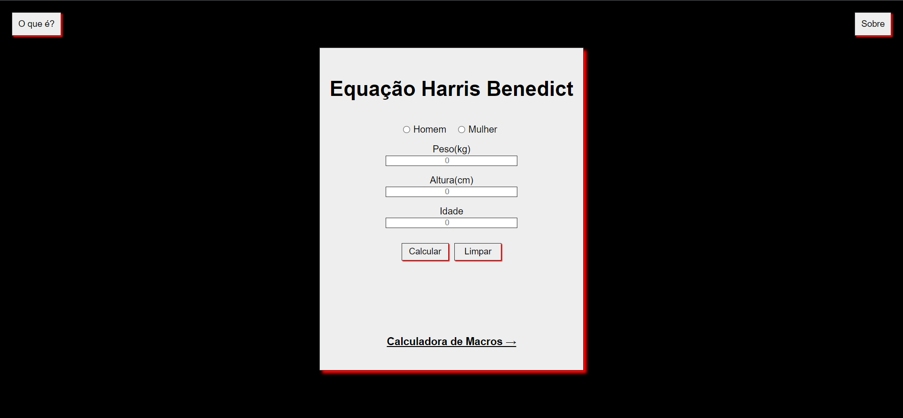
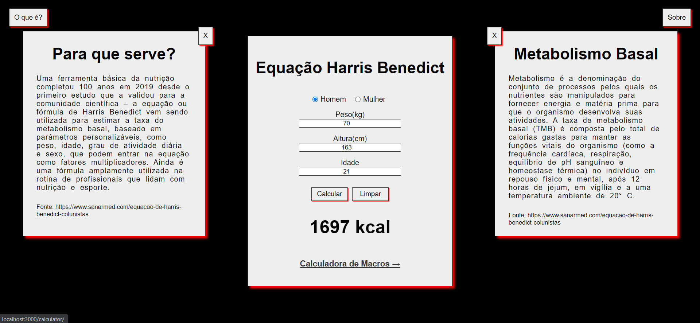
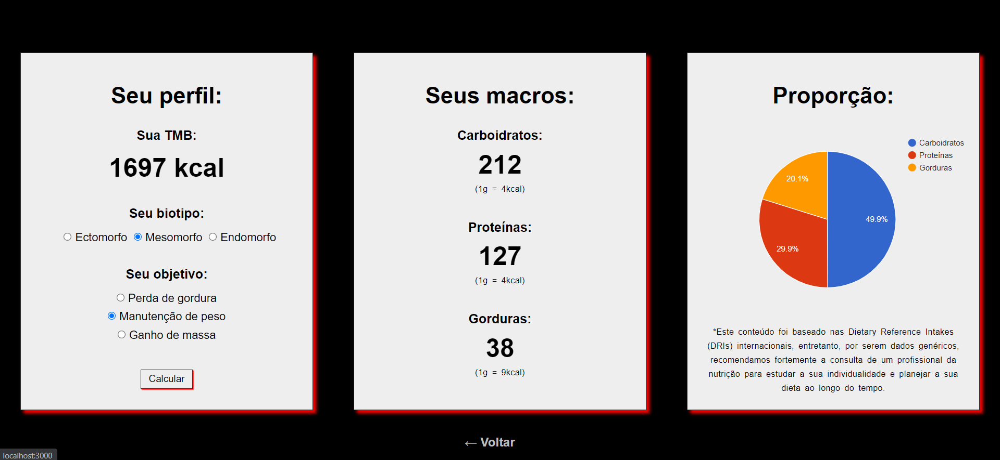

# Calculadora de Macros

  

# Sobre

O projeto da calculadora de macros vem acompanhado de um formulário referente a Equação de Harris Benedict, que calcula a nossa TMB (taxa de metabolismo basal), e se baseia nesse dado para disposição de macros a depender do seu biotipo e objetivo para com a dieta, apresentando os dados expressos e em gráfico.

# Dependências

As principais dependências para realização desse projeto foram:

- react-router-dom 
- react-google-charts
- styled-components

# Inicialização

Um projeto que contou desde o início com o Vite, pode ser inicializado a partir do script `npm run dev` e o comando `vite` irá rodar a aplicação na aba local http://localhost:3000.